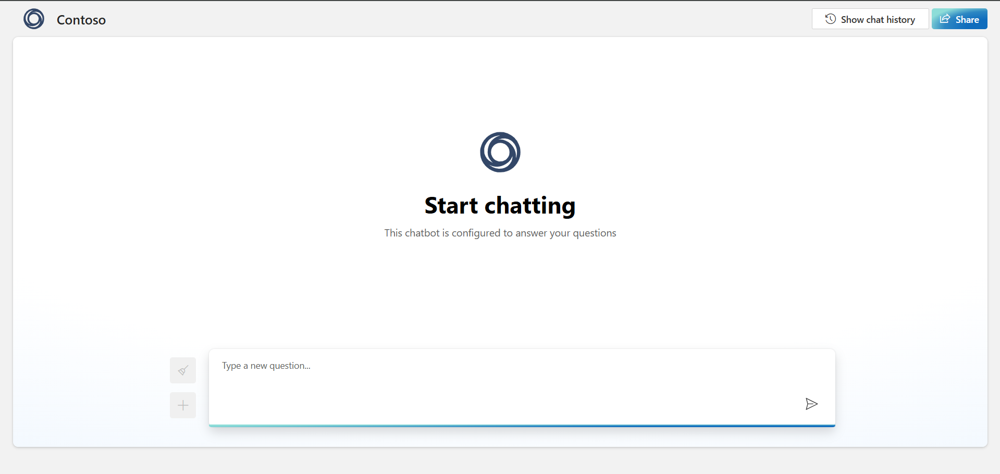
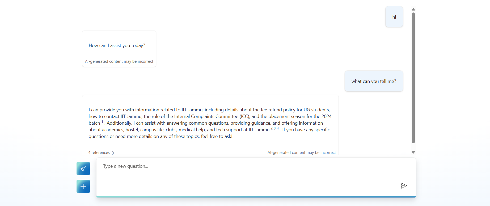
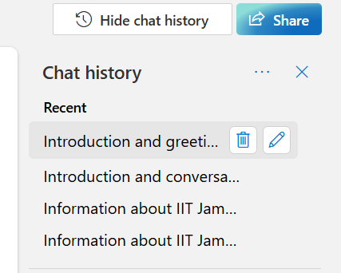

# 💬 Azure FAQ Chatbot

This is an AI-powered FAQ chatbot created using Microsoft Azure. It answers user queries about IIT Jammu and is deployed on an Azure Web App.

## 🚀 Live Demo
👉 [Click here to talk to the bot](https://chitchitchat.azurewebsites.net)

## 🛠️ Technologies Used
- Azure Bot Service
- Azure Web App
- Azure QnA Maker / Language Studio
- Bot Framework Web Chat

## 📸 Screenshots

### 🔹 Chatbot Interface

### 🔹 Sample Response

### 🔹 Chat History Support

## 🧠 Features
- Answers FAQs about IIT Jammu
- Built without writing manual code
- Uses Azure-hosted AI capabilities
- Deploys directly to a web app

